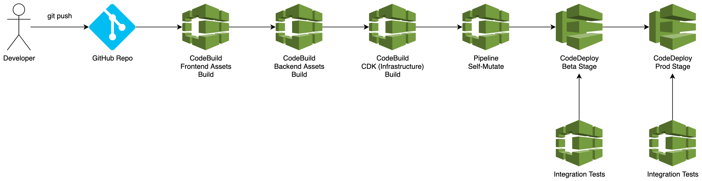
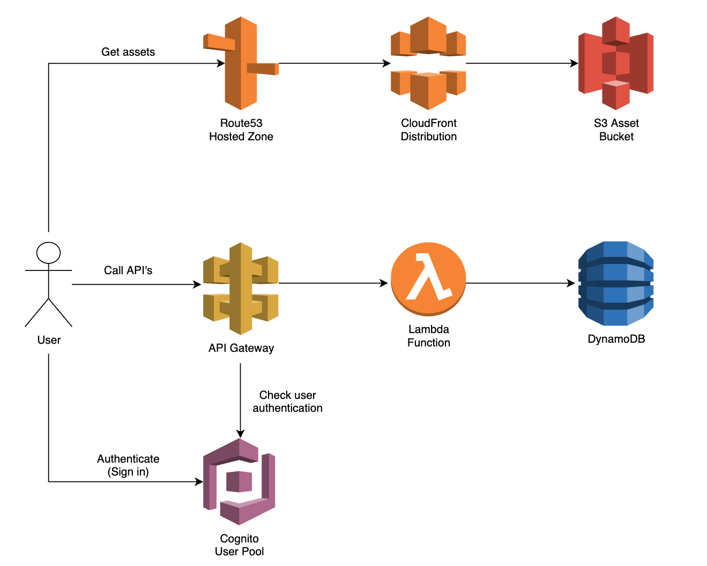

# TicketManager

https://github.com/KyranDalton/TicketManager

### **Overview**

TicketManager is a webapp for creating and tracking trouble tickets. It allows regular users to view tickets and create new tickets, and admin users to edit and delete tickets. TicketManager is protected with Cognito authorization.

### **Architecture**

TicketManager is build using serverless AWS resources, making it incredibly secure and scalable. It contains a self-mutating CodePipeline which means any changes (to the pipeline, assets, or AWS resources) are applied continuously. The pipeline builds all assets as well as running tests to ensure bad changes are not released.

The frontend infrastructure consists of a CloudFront distribution, caching the frontend assets at local edge points giving the customer reduced latency no matter where they are in the world, backed by assets in S3. A Route53 hosted zone gives the distribution a custom domain name.

The backend infrastructure consists of a Cognito User Pool for managing users, HTTP API Gateway protected with Cognito auth with a AWS Lambda integration acting as the 'server'. Additionally, a DynamoDB table is used to store ticket information.

### **Development**
1) Check out this package using the GitHub CLI `gh repo clone KyranDalton/TicketManager`
2) Build the backend assets `cd backend && npm i && npm run build && cd ../`
3) Build the frontend assets `cd frontend && npm i && npm run build && cd ../`
4) Build the compile the infrastructure code `cd infrastructure && npm i && npm run build`
5) Deploy the pipeline stack, this will trigger deployments of the Beta + Prod stacks `npm cdk deploy TicketManagerPipelineStack`
